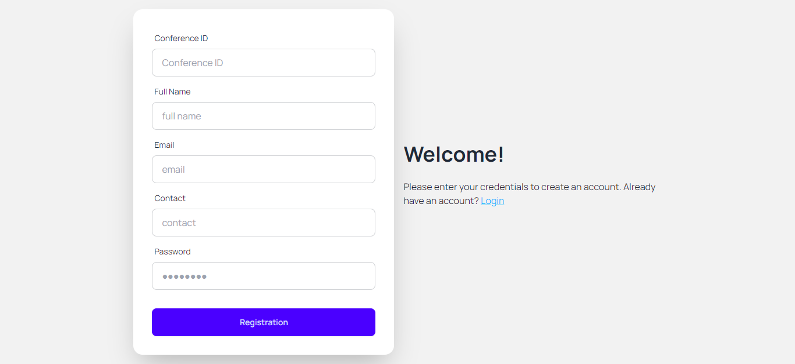

# GUB Conference Dynamic Website

This is a website build using HTML, CSS, Tailwind CSS, Daisy UI, and JavaScript in Frontend. In my backend I've used PHP & MySQL. This website make for personal practice or study purpose. The UI and functions are shown below.

## Website Landing Page UI

## Registration Page

## Login Page

## Important Dates Input from Backend

## Committee Input from Backend

